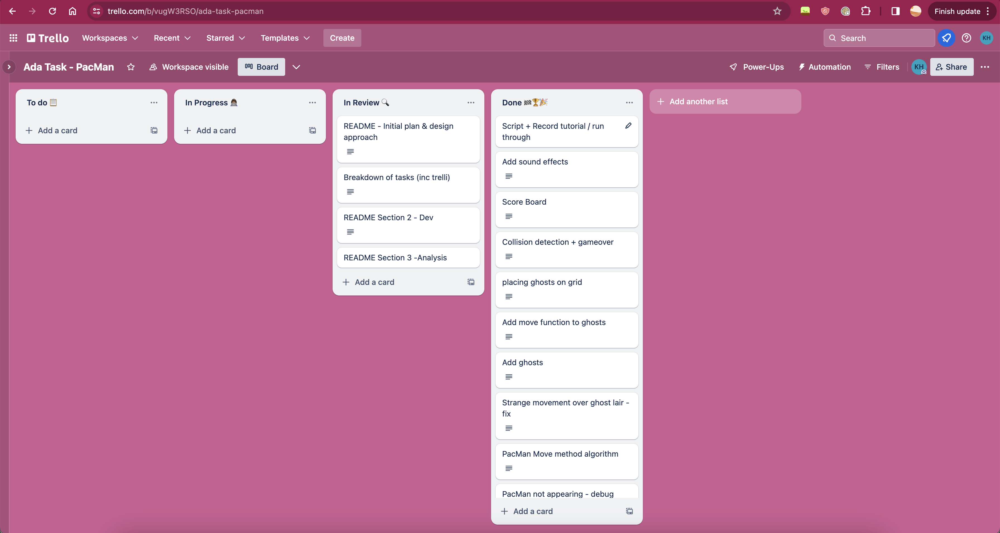

# PacMan – ADA Project
## Section 1, Challenge Outline. 

### 1a. Problem Summary 
This project revolves around the development of a variant of the iconic Pac-Man game, adhering closely to its traditional gameplay mechanics while emphasising the application of coding best practices throughout development. The primary objective is to create a fully functional program featuring a user interface that facilitates game initiation, gameplay, and restart options. Modifications have been introduced to the classic game design; for instance, the lateral passageways that allowed characters to move from one side of the game board to the opposite side have been sealed off. Additionally, while the original game featured four ghosts, each with their unique movement strategies, this version simplifies their behaviour to random movements, diverging from the original's complexity.

### 1b. UML Diagram and Project Structure. 
#### UML Diagram: 

### 1c. Innitial Plan and Design Approach.

This project adopts the Model/View/Controller (MVC) architectural pattern to structure the Pacman game. The MVC pattern aids in separating concerns, allowing for more manageable code, easier maintenance, and the flexibility to extend the game with new features. Detailed below are the roles each component plays within the game architecture and how they interact to deliver a seamless and engaging gaming experience.

#### Model
The Model component acts as the heart of the game's logic and state. It is responsible for maintaining the game's dynamic data structure and the rules that govern changes to this structure. Within the Model, key classes include:

GameBoard: Represents the game grid where Pacman and ghosts move. It is responsible for tracking the positions of all game objects, including walls, dots, power pills, and characters.
Index: Serves as an entry point for game initialization, setting up the game board and populating it with dots, walls, and characters based on predefined level layouts.
These objects are instantiated and structured through their respective constructors during the game's initialization phase. The Model ensures that the game state is always current, reflecting the results of player interactions and game logic.

#### View
The View component is tasked with rendering the game state to the player. It listens for changes in the Model and updates the visual representation of the game accordingly. In this implementation, the main game loop acts as part of the View, determining which objects to draw and refresh on the screen. This includes drawing the game board, Pacman, ghosts, and updating scores and game status messages.

The separation of the View from the game logic allows for a clear distinction between how the game works and how it is presented, facilitating potential future enhancements such as supporting different rendering technologies or user interfaces.

#### Controller
The Controller component mediates input from the player, translating it into actions that modify the Model. It houses classes responsible for character movements, collision detection, and game state transitions. These include:

Pacman: Handles input for Pacman's movement, ensuring it follows the game rules for navigation and interactions (e.g., eating dots or power pills).
GhostMoves: Manages the ghost movements, dictating their behavior based on the game state (e.g., chasing Pacman or fleeing when vulnerable).
Controllers modify attributes within the Model to reflect the current game state, ensuring the Model and View remain synchronised. This separation of concerns allows for the independent development and testing of game logic and player interactions.

### 1d. Tasks Breakdown.
In managing the Pacman game project, I employed Trello as a central tool for task organization and team coordination. The Trello board for the project was meticulously organized into four distinct columns: "To Do", "In Progress", "In Review", and "Done!" This setup allowed for a clear and dynamic representation of the project's workflow. Each task, whether it involved initial design decisions, coding specific game features, or conducting thorough testing, was added as a card under the appropriate column. As tasks progressed, they were moved from "To Do" to "In Progress", then "In Review" for quality checks, and finally to "Done!" upon completion. This visual progression on the Trello board not only facilitated an effective tracking mechanism but also fostered a sense of achievement as tasks visibly moved towards completion. 
Below is a screenshot of my Trello board showing some of my tasks. 

### 1e. Object-oriented design.
In the development of the Pacman game, object-oriented design principles played a crucial role in structuring the program and ensuring its scalability and maintainability. By adhering to the core concepts of encapsulation, inheritance, and polymorphism, the game's architecture was both robust and flexible, facilitating the addition of new features and the modification of existing ones with minimal disruption to the overall codebase. Each game component, including Pacman, the ghosts, the game board, and other elements like power pills, was modeled as a distinct class. This approach allowed for the encapsulation of specific behaviors and properties within each class, thereby localizing changes to individual components and reducing the risk of unintended side effects across the system.

The use of inheritance was particularly effective in creating a hierarchical structure for game entities, allowing shared behaviors to be defined in base classes while enabling specific variations to be implemented in derived classes. For instance, the Ghost class could be extended to create different types of ghosts with unique movement strategies, yet all could be managed through the same interface, demonstrating polymorphism in action. This not only streamlined the development process but also made the code more understandable and easier to debug. 

Furthermore, the design embraced the principle of separation of concerns by clearly delineating the responsibilities of each class. The GameBoard class, for example, was responsible for managing the layout and state of the game environment, while the logic for character movement and interaction was encapsulated within the Pacman and Ghost classes. This clean separation facilitated independent development and testing of components, enhancing the team's ability to work on different parts of the game concurrently without conflict. Overall, the object-oriented design of the program provided a solid foundation that supported the development of a complex, interactive game, demonstrating the power of OOP in creating structured, efficient, and adaptable software.

## Section 2, Development. 

### 2a. Adopting Best Practices.
In building the Pacman game, I made sure to follow as many best practicies as I could to keep our code tidy and easy to work with. I stuck to clear naming for the variables and functions, and organised the code neatly into files and folders, which made it simple for me to understand what's going on and additianllay making it easy to follow for potential contributions by others. Whenever I spotted something that could be done better, I didn't hesitate to clean it up through regular refactoring, working to ensure that the code stayed clean and ready for whatever new features I wanted to add down the line.

Testing was another big part of the process. I made sure to thoroughly test each piece of the game, both on its own and when it interacts with other parts. I tried to wtite tests before coding a new feature, so that I could catch any issues early and build with confidence. I regularly tested the code which reasurred me that everything's working as it should. These practices helped me create a Pacman game that not only plays great but also sets us up for smooth sailing in future updates and improvements.

### 2b. Reviewing Code Changes.
During the project, teaming up with my work colleague for code reviews was very helpful. We made it a point to regularly check in and go over the latest code together, using GitHub to easily highlight and discuss any bits that caught our eye. It wasn't just about looking for mistakes; these sessions were golden opportunities to swap ideas and fine-tune our approach, making sure our code was as clean and efficient as possible. Getting a fresh set of eyes on my work helped spot things I might've missed and brought new, interesting ways to tackle problems to the table. These relaxed yet productive code review meet-ups not only helped improve code quality but also made the whole coding journey a lot more fun and collaborative.

### 2c. Code Refactoring.
Code refactoring was a key part of our development process, ensuring that our code remained clean, efficient, and easy to maintain as the project progressed. One notable example of refactoring in our codebase involved optimizing the movement logic for our characters, particularly Pacman. Initially, the movement logic was scattered across multiple methods, making it difficult to follow and prone to bugs. To improve this, we consolidated the movement logic into a single method within the Pacman class, simplifying the code and making it easier to understand. By doing so, we not only eliminated redundant code but also improved the overall performance of our game. 

### 2d. Quality Assurance. 
Using a Debugger Extension in Visual Studio Code (VS Code) improved the quality assurance process for our Pacman game project. This tool allowed us to dive deep into the code, helping us see what was happening behind the scenes as the game ran. We could pause the execution at specific points using breakpoints, which was particularly handy for tracking down bugs or understanding complex code paths. This hands-on approach to debugging helped us identify issues quickly, often saving us time that would have otherwise been spent on guesswork and manual testing.

Incorporating the Debugger Extension into our regular development routine meant we were catching and fixing problems much earlier. It wasn't just about fixing bugs; it was about making sure our code was clean and efficient from the start. Being able to inspect variables and execute code on the fly allowed us to understand exactly how our changes affected the game's behavior, leading to more reliable code overall. This methodical approach to debugging made our development process smoother and helped ensure that the final version of our game was as stable and bug-free as possible.

## Section 3, Analysis. 
